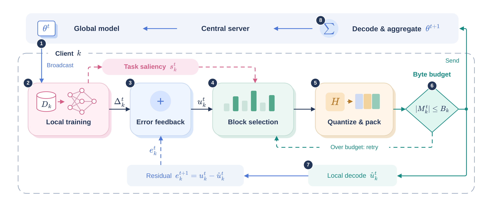

# FedMPSQ

Official code and lightweight reproducibility artifact for:

> **FedMPSQ: Minority-Prioritized Sparse-Quantized Federated Learning for Communication-Efficient IoT Intrusion Detection**  
> Nguyen Van Thuong, Nguyen Huu Quyen, and Van-Hau Pham — RIVF 2026

[Paper source](paper/main.tex) · [Data and checkpoints (Google Drive)](https://drive.google.com/drive/folders/10Yf5bLRPGMUSmt-7EfINqieBaItCSCEn?usp=drive_link) · [Data protocol](docs/DATA.md) · [Reproducibility guide](docs/REPRODUCIBILITY.md)

FedMPSQ combines class-balanced and logit-calibrated local learning, task-gradient saliency, sparse update selection, low-bit quantization, error feedback, and a serialized-byte controller. The paper evaluates the method on the 34-class CICIoT2023 task with frozen partitions of **10 and 100 clients**, against eight baseline runs.

## FedMPSQ workflow



One communication round broadcasts the global model, performs local task-aware training, applies error feedback and block selection, quantizes the selected update under a strict byte budget, and aggregates the decoded client messages at the server.

## Reported results

All values below are from round 20, seed 42, on the frozen client-validation splits. Upload is the measured mean serialized message per client per round in decimal KB.

| Clients | Method | Accuracy (%) | Macro-F1 (%) | Upload (KB) |
|---:|---|---:|---:|---:|
| 10 | FedAvg | 74.53 | 38.36 | 1397.020 |
| 10 | FedProx | 75.56 | 36.98 | 1397.020 |
| 10 | BDD-HFL | 61.92 | 31.83 | 1397.020 |
| 10 | BDD-HFL-mu | 73.03 | 35.41 | 1397.020 |
| 10 | FAP | 75.44 | 37.24 | 1397.020 |
| 10 | FAP-mu | 75.47 | 37.90 | 1397.020 |
| 10 | FedPAQ | 71.50 | 35.70 | 176.508 |
| 10 | DAdaQuant | 75.94 | 38.05 | 5.148 |
| 10 | **FedMPSQ** | 75.12 | **39.17** | **3.329** |
| 100 | FedAvg | 74.91 | 37.85 | 1397.020 |
| 100 | FedProx | 74.87 | 37.96 | 1397.020 |
| 100 | BDD-HFL | 71.01 | 27.52 | 1397.020 |
| 100 | BDD-HFL-mu | 71.12 | 27.57 | 1397.020 |
| 100 | FAP | 74.82 | 37.77 | 1397.020 |
| 100 | FAP-mu | 74.72 | 37.86 | 1397.020 |
| 100 | FedPAQ | 74.89 | 37.43 | 176.508 |
| 100 | DAdaQuant | 74.82 | 37.49 | 4.700 |
| 100 | **FedMPSQ** | **78.56** | **38.91** | **3.039** |

The paper's central limitation also matters: the minority-recall advantage is strong at 10 clients but falls close to the best baseline at 100 clients. The two partitions use different construction procedures and preprocessing fits, so their difference is not interpreted as a controlled causal effect of client count.

## Repository layout

```text
.
├── app/                 # Flower entry points
├── configs/             # experiment protocols and frozen partition manifests
├── data/                # dataset readers and preprocessing code; no samples
├── extensions/          # distillation, pruning, quantization, and FedMPSQ codec
├── fl/, models/, training/
├── scripts/             # preparation, training, audit, and artifact reproduction
├── notebooks/           # two clean Kaggle entry notebooks
├── results/
│   ├── paper/            # lightweight metrics/config snapshots for 18 reported runs
│   ├── tables/           # regenerated main and communication tables
│   ├── figures/          # regenerated learning-curve and minority figures
│   └── summaries/        # compact K=10/K=100 result summaries
├── paper/               # LaTeX source, figures, tables, and result mapping
├── tests/               # core source-level and synthetic tests
└── docs/                # data and experiment protocols
```

No CICIoT2023 samples, checkpoint, model weight, virtual environment, training log, or full client-history artifact is committed to GitHub. Data and checkpoints are provided separately through the [Google Drive archive](https://drive.google.com/drive/folders/10Yf5bLRPGMUSmt-7EfINqieBaItCSCEn?usp=drive_link). The paper PDF can be built from `paper/main.tex` using the instructions in `paper/README.md`.

## Installation

Python 3.11 or newer is required; the reported jobs used Python 3.12 and CUDA-enabled PyTorch.

```bash
python -m venv .venv
source .venv/bin/activate        # Windows: .venv\Scripts\activate
python -m pip install --upgrade pip
python -m pip install -e ".[paper]"
```

## Data and checkpoints

The prepared data and reproduction checkpoints are available in [Google Drive](https://drive.google.com/drive/folders/10Yf5bLRPGMUSmt-7EfINqieBaItCSCEn?usp=drive_link). They are deliberately excluded from GitHub because of their size. To rebuild the prepared partitions from source, download CICIoT2023 from the dataset owner and follow the data protocol. The exact manifests are:

- `configs/partitions/10_clients_manifest.json`
- `configs/partitions/100_clients_manifest.json`

See [docs/DATA.md](docs/DATA.md) for layout, provenance, partition hashes, and the important distinction between the two scales.

## Run Baselines

The same command supports 10 or 100 clients. It prints a resolved plan unless `--execute` is supplied.

```bash
python scripts/run_paper34_campaign.py \
  --scenario fedavg \
  --num-clients 10 \
  --seed 42 \
  --partitions-dir /path/to/prepared-10 \
  --partition-file configs/partitions/10_clients_manifest.json \
  --output-root results/local
```

The eight baseline slugs are listed in [docs/REPRODUCIBILITY.md](docs/REPRODUCIBILITY.md).

## Run FedMPSQ

The reported arm uses a 3,334-byte cap at 10 clients and a 3,044-byte cap at 100 clients.

```bash
python scripts/run_uplink_v4.py \
  --data-dir /path/to/prepared-10 \
  --manifest configs/partitions/10_clients_manifest.json \
  --output results/local/fedmpsq-10 \
  --clients 10 \
  --arm rht_g4_b3334 \
  --seed 42 \
  --seeds 42
```

For 100 clients, select the 100-client manifest and `--arm rht_g4_b3044_c100`. Append `--run --evaluate-test` after reviewing the generated plan.

## Recreate paper artifacts

The committed metric snapshots are small outputs needed to verify the reported tables and plots; they contain no packet samples or learned parameters. Raw training logs remain excluded from the public artifact.

```bash
python scripts/reproduce_paper_artifacts.py
```

This writes regenerated CSV tables, JSON summaries, and PDF/PNG figures to `results/tables/`, `results/summaries/`, and `results/figures/`.

## Reviewer smoke test

Run every one of the 18 method-by-client-count paths on a deterministic synthetic fixture. Each completed fixture is also checked by the fail-closed artifact audit; no GPU or raw dataset is required.

```bash
python scripts/smoke_test_paper34.py
```

## Notebooks

The two notebooks are optional front ends for Kaggle:

- `01_run_baselines_kaggle.ipynb` supports every baseline run at 10 or 100 clients.
- `02_run_fedmpsq_kaggle.ipynb` selects the reported FedMPSQ run for either scale.

They contain no outputs, embedded datasets, personal Kaggle usernames, fixed local Windows paths, or source archives. The Python runners remain the canonical interface, which keeps notebook logic short and reviewable.

## Tests

```bash
python -m unittest discover -s tests -v
```

The test suite uses temporary or synthetic data and does not download CICIoT2023.

## Citation

GitHub reads [`CITATION.cff`](CITATION.cff) and exposes a **Cite this repository** action. Please use the paper citation shown there.

## License

Apache License 2.0. See [LICENSE](LICENSE).
